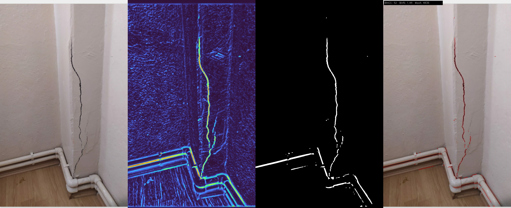

# 🏗️ LifeCoreSen - Bina Duvar ve Kolon Teşhis Sistemi

Bina duvarları ve kolonları üzerindeki **çatlakları** ve **dökülen sıva** parçalarını otomatik olarak tespit eden görüntü işleme uygulaması.

## 📋 Özellikler

- **Çatlak Tespiti (Panel)**: Response (renkli) + binary maske ile çatlak adaylarını çıkarır ve overlay üzerinde çizer
- **Ana Pipeline (Main.py)**: ORB Feature Detection + Canny Edge Detection ile çatlak tespiti (mevcut akış)
- **Dökülen Sıva Tespiti**: Renk anomalisi, parlaklık değişimi ve kenar analizi ile dökülen sıva bölgelerini bulur
- **Görsel Raporlama**: Panel formatında tek görselde karşılaştırmalı çıktı üretir

## 🎨 Panel Açıklaması

| Panel Parçası | Anlam |
|--------------|-------|
| original | Orijinal görüntü |
| response (renkli) | Çatlak benzeri yapıların yoğunluk haritası |
| binary | Response üzerinden eşiklenmiş aday çatlak maskesi |
| overlay | Binary’den çizilen ince kırmızı konturlar |

## 📸 Örnek Sonuç

Panel çıktısı 4 parçadan oluşur:
`original | response (renkli) | binary | overlay`

### Örnek Panel (image1)


### Örnek Panel (image3)


## 🚀 Kurulum

```bash
# Repoyu klonla
git clone https://github.com/KULLANICI_ADI/LifeCoreSen.git
cd LifeCoreSen

# Virtual environment oluştur
python -m venv .venv
source .venv/bin/activate  # Linux/Mac
# veya
.venv\Scripts\activate  # Windows

# Bağımlılıkları yükle
pip install -r requirements.txt
```

## 💻 Kullanım

### Panel (Önerilen)
Tek bir görsel:
```bash
./.venv/bin/python crack_yolo.py images/image1.jpeg
```

Tüm görseller:
```bash
./.venv/bin/python crack_yolo.py --all
```

Panel çıktıları `results/` klasörüne `image*_panel.jpg` olarak yazılır.

### Ana Pipeline (Main.py)
```bash
python Main.py images/image1.jpeg
```


### Sonuçlar
İşlenen resimler `results/` klasörüne `<dosya_adı>_result.jpeg` formatında kaydedilir.

### Karşılaştırmalı Test (Panel-only)
Tüm görseller için tek tip panel ve metrik tablosu üretir:
```bash
./.venv/bin/python better_tests.py --images images --out results/tests
```

- Paneller: `results/tests/image*_panel.jpg`
- Özet tablo: `results/tests/summary.csv`


## ⚙️ Konfigürasyon

`config.py` dosyasından tespit parametrelerini ayarlayabilirsiniz:

